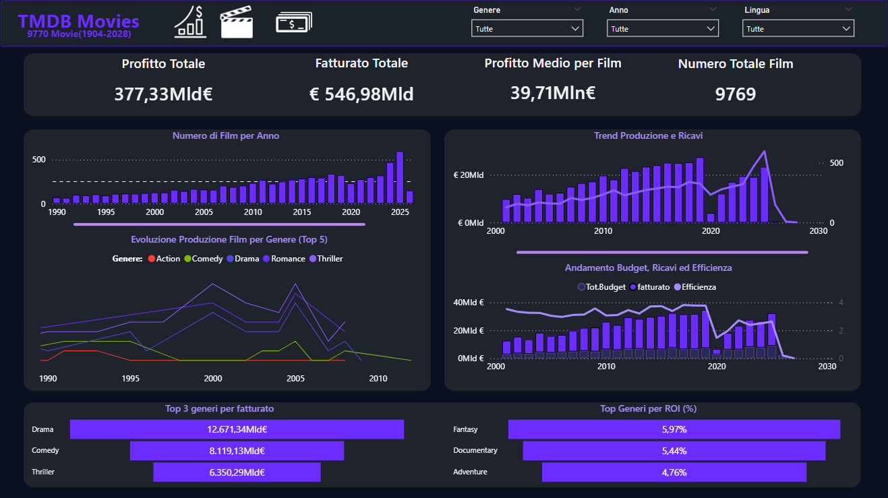
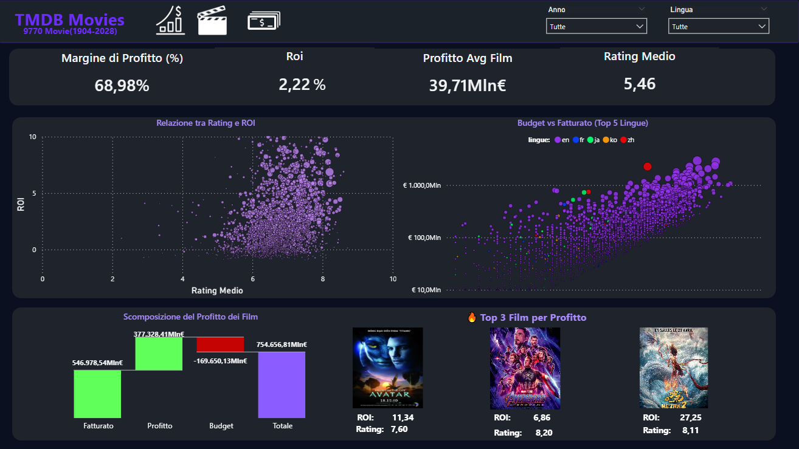
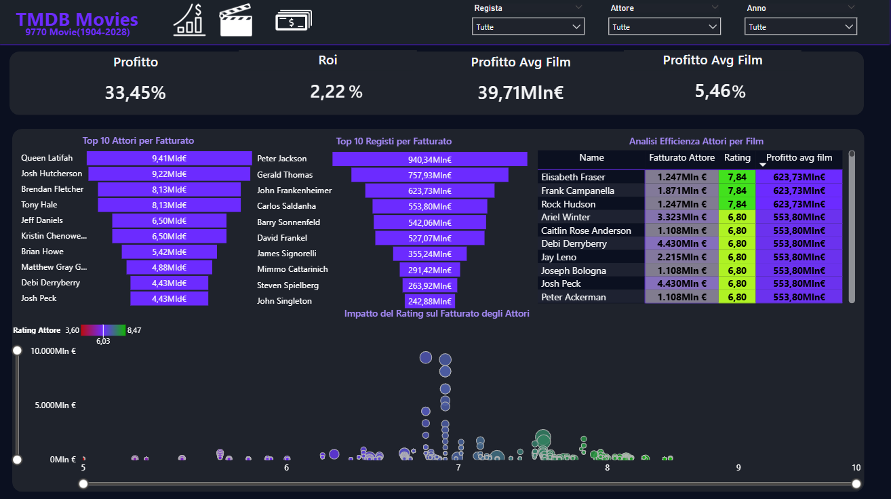

# 🎬 TMDB Movies Analytics Dashboard | Power BI
Progetto di Business Intelligence end-to-end finalizzato all’analisi del settore cinematografico, con l’obiettivo di trasformare dati complessi in insight strategici su redditività, trend e driver di performance tramite Power BI.
<p align="center">
  
</p>

<h3 align="center">
Progetto di Business Intelligence focalizzato su redditività, trend di mercato e driver di performance nel settore cinematografico
</h3>

<p align="center">
Soluzione end-to-end sviluppata in <strong>Power BI</strong>, supportata da preparazione dati in <strong>SQL</strong> e modellazione KPI in <strong>DAX</strong>.
</p>

---

## 🚀 Navigazione Rapida

<p align="center">
  <a href="#-overview--trend">
    
  </a>
  <a href="#-performance">
    
  </a>
  <a href="#-people--quality">
    
  </a>
</p>

---

## 📌 Panoramica del Progetto

Questo progetto analizza il dataset **TMDB (The Movie Database)** con l’obiettivo di trasformare dati grezzi in uno strumento decisionale basato su insight.

La dashboard consente di analizzare:

- la redditività dei film  
- l’andamento del mercato nel tempo  
- la relazione tra qualità (rating) e performance economica  
- l’impatto del budget sui ricavi  
- il contributo di generi, attori e registi  

La soluzione integra:

- **SQL** → esplorazione e preparazione dati  
- **Power BI** → visualizzazione e analisi  
- **DAX** → definizione KPI e logiche di calcolo  

---

## 🎯 Obiettivi di Business

La dashboard è progettata per rispondere a domande chiave:

- Quali film generano il maggior profitto?  
- Esiste una relazione tra rating e ROI?  
- Il budget influisce realmente sul fatturato?  
- Quali generi sono più performanti?  
- Quanto incidono attori e registi sui risultati economici?  

---

## 📊 KPI Monitorati

- **Fatturato Totale**  
- **Profitto Totale**  
- **Profitto Medio per Film**  
- **ROI (Return on Investment)**  
- **Margine di Profitto (%)**  
- **Rating Medio**  
- **Numero Totale Film**  

---

## 🗄️ Data Preparation & Analisi SQL

Prima dello sviluppo della dashboard, è stata effettuata un’analisi esplorativa tramite SQL.

### Attività svolte:

- conteggio totale dei film  
- distribuzione dei film per anno  
- top film per fatturato e profitto  
- analisi dei rating  
- percentuale di film profittevoli  
- performance per genere  
- analisi attori e registi  
- identificazione film ad alto budget  

### Ruolo della fase SQL

Questa fase ha permesso di:

- validare la qualità dei dati  
- definire KPI coerenti  
- individuare le variabili rilevanti  
- costruire una base solida per Power BI  

---

# 🧩 Struttura della Dashboard

---

## 🔹 Overview & Trend

<p align="center">
  
</p>

### 🎯 Obiettivo
Fornire una visione **macro e strategica** del settore cinematografico.

### 📊 Contenuti
- KPI principali  
- numero di film nel tempo  
- trend del fatturato  
- distribuzione e andamento dei generi  
- top generi per performance  

### 🧠 Insight principali
- crescita della produzione cinematografica nel tempo  
- concentrazione del fatturato in specifici generi  
- evoluzione delle preferenze del pubblico  

### 💡 Valore della pagina
Questa pagina rappresenta il punto di ingresso della dashboard, utile per comprendere rapidamente il contesto generale e individuare trend di lungo periodo.

---

## 🔹 Performance

<p align="center">
  
</p>

### 🎯 Obiettivo
Analizzare i principali driver della redditività.

### 📊 Contenuti
- analisi waterfall del profitto  
- relazione tra rating e ROI  
- relazione tra budget e fatturato  
- top film per profitto  

### 🧠 Insight principali
- il rating può influenzare il ritorno economico  
- budget elevati non garantiscono sempre alti profitti  
- presenza di outlier con performance eccezionali  

### 💡 Valore della pagina
Questa è la sezione più analitica del progetto: permette di comprendere **come e perché** i film generano profitto.

---

## 🔹 People & Quality

<p align="center">
  
</p>

### 🎯 Obiettivo
Valutare l’impatto del capitale umano sui risultati economici.

### 📊 Contenuti
- top attori per fatturato  
- top registi  
- analisi di efficienza (rating + profitto)  
- relazione tra qualità e performance  

### 🧠 Insight principali
- alcuni attori e registi contribuiscono in modo consistente al successo  
- il fattore umano è determinante nei risultati  
- esiste una correlazione tra qualità percepita e performance economica  

### 💡 Valore della pagina
Introduce una prospettiva avanzata: non solo dati economici, ma anche il ruolo delle persone nel determinare il successo.

---

## 🛠 Tecnologie Utilizzate

- **Power BI**  
- **DAX**  
- **SQL**  
- **Data Modeling**  
- **Data Cleaning**  

---
## 📥 Accesso alla Dashboard
   📥 **Download Dashboard:** [Scarica il file Power BI](TMDB-Dashboard.pbix)
## 📁 Struttura del Repository

```text
TMDB-Movies-PowerBI-Dashboard
│
├── TMDB-Dashboard.pbix
├── README.md
└── images/
    ├── 0_overview.png
    ├── 1_performance.png
    └── 2_people.png

